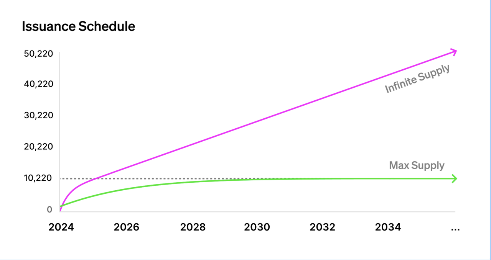
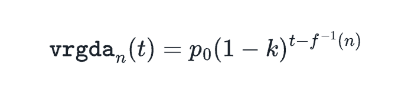
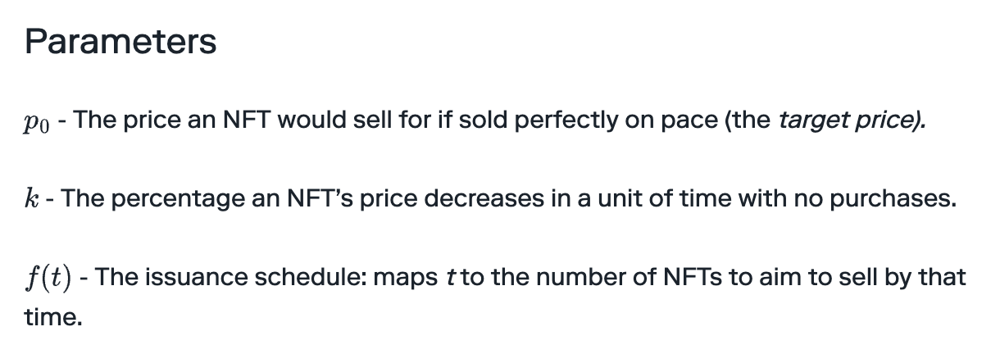
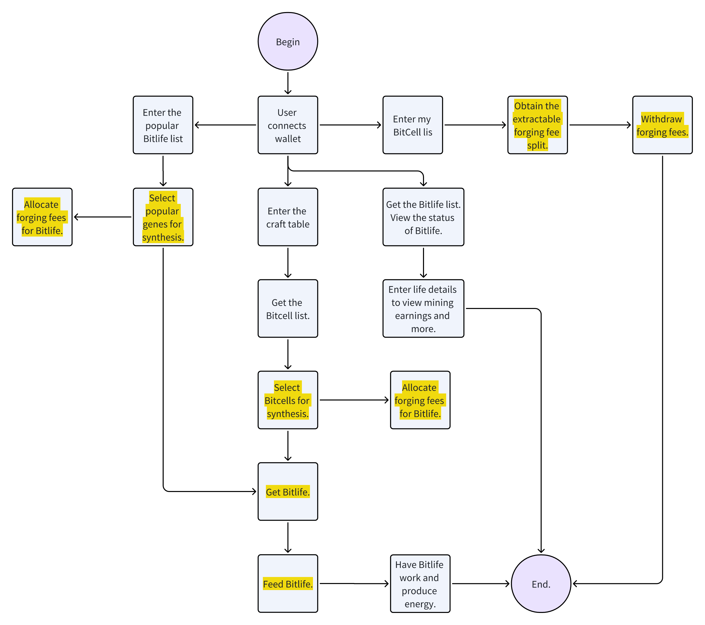

# Cellula Solidity
- [1. Project Overview](#1-project-overview)
  * [1.1 Project Background](#11-project-background)
  * [1.2 Project Objectives](#12-project-objectives)
- [2. Product Requirements](#2-product-requirements)
  * [2.1 Core Algorithm](#21-core-algorithm)
  * [2.2 Issuance Mechanism](#22-issuance-mechanism)
  * [2.3 Issuance Curve](#23-issuance-curve)
    + [The VRGDA formula used by Cellula](#the-vrgda-formula-used-by-cellula)
    + [Here are the definitions for reference:](#here-are-the-definitions-for-reference)
  * [2.4 Logical Components](#24--logical-components)
    + [2.4.1 BitCell Issuance](#241-bitcell-issuance)
    + [2.4.2 BitLife Issuance](#242-bitlife-issuance)
    + [2.4.3 Food Requirements in BitLife](#243-food-requirements-in-bitlife)
    + [2.4.4 Earnings Extraction](#244-earnings-extraction)
- [3. Technical architecture](#3-technical-architecture)
  * [3.1 Main modules](#31-main-modules)
  * [3.2 Interface description](#32-interface-description)
    + [3.2.1 CellGame.sol](#321-cellgamesol)
    + [3.2.2 Life.sol](#322-lifesol)
    + [3.2.3 Energy.sol](#323-energysol)
    + [3.2.4 Helps.sol](#324-helpssol)
  * [3.3 The data flow diagram is as follows](#33-the-data-flow-diagram-is-as-follows)
  * [3.4 Front-end framework](#34-front-end-framework)
  * [3.5 Environment and Tools.](#35-environment-and-tools)
- [4. Testing related information](#4-testing-related-information)

# 1. Project Overview
Cellula, the Full-Chain Game, is an innovative project that combines cellular automata and VRGDA distribution curve to create a brand-new gaming and asset distribution method.
## 1.1 Project Background
Most discussions about Full-onChain Games focus on their future prospects. However, the Cellula team is more interested in pushing the boundaries of blockchain gaming and breaking free from the imitation of traditional games. Just like MakerDAO and Uniswap made their mark in decentralized finance without imitating traditional finance, we are committed to providing players with an unprecedented experience, one that existing Web2 and Web2.5 gamers have never encountered before. To achieve this goal, we have combined cellular automata with the VRGDA distribution mechanism, creating a brand-new Full-onChain Game called Cellula. 
## 1.2 Project Objectives
Cellula has currently developed an asset-based permissionless gaming mechanism that aims to provide a groundbreaking gaming experience and innovative asset distribution method for both crypto gamers and traditional gamers. By combining the rules of Conway's Game of Life with the VRGDA distribution mechanism, Cellula introduces new concepts and possibilities for players in Web2 and Web2.5 games. 
# 2. Product Requirements
## 2.1 Core Algorithm
1. Implementing NFT issuance pricing based on the Variable Rate Gradual Dutch Auction mechanism.（https://www.paradigm.xyz/2022/08/vrgda ） 
2. Achieving the effect of a gradual Dutch auction through a customizable token issuance model: when market demand exceeds expectations, the price increases; conversely, when market demand falls below expectations, the price decreases; and when market demand aligns with expectations, the price remains constant.
## 2.2 Issuance Mechanism
1. We have issued two types of NFTs: BitCell and BitLife.
2. BitCell is the core asset and is issued in limited quantities. Each set of BitCell contains 511 units, and a total of 20 sets have been issued, resulting in a total supply of 10,220 units.
3. BitLife is obtained by leasing BitCell and conducting synthesis forging, and its total supply is unlimited.
## 2.3 Issuance Curve
Using the VRGDA method, we will auction the two types of NFTs: BitCell with a fixed total supply of 10,220 units and BitLife with no upper limit on the total supply. The following graph illustrates the issuance rate of these two types of NFTs:

### The VRGDA formula used by Cellula

### Here are the definitions for reference:
Parameter Definitions Reference: Variable Rate GDAs（https://www.paradigm.xyz/2022/08/vrgda ）  
GitHub: https://github.com/transmissions11/VRGDAS
## 2.4  Logical Components
### 2.4.1 BitCell Issuance
1. There are a total of 10,220 BitCells, divided into 20 groups, with each group containing 511 different cells.
2. Each BitCell is a 3x3 matrix and incorporates the evolutionary logic of Conway's Game of Life. For detailed information, please refer to: https://en.wikipedia.org/wiki/Conway%27s_Game_of_Life.
3. The issuance quantity and price of BitCells are calculated using a logical function. As the number of auctions and time progresses, the price gradually approaches the target price.
4. BitCells can be sold in groups, with each group independently minted for sale.
5. Users can lease BitCells without permission and only need to pay the minting fee to use them.
6. The currently set parameters are as follows:
- Target price (targetPrice_): The initial price per cell is 0.0001.
- Price decay percentage (priceDecayPercent_): If there are no successful auctions within a day, the price decays by 10%.
- Expected sales quantity per day (perTimeUnit_): It is estimated that 511 cells will be sold per day.
- Auction start time (startTime_): The starting timestamp of the auction.
- Max sellable quantity for this auction round (maxSellable_): There are a total of 511 cells available for sale in this auction.
- Starting TokenID for this auction round (startTokenID_): The starting TokenID for this auction is the TokenID from the previous auction.
7. Please ensure that the auction range does not overlap with other TokenIDs.
### 2.4.2 BitLife Issuance
1. Each BitLife NFT requires a combination of 2 to 9 BitCells to be minted.
2. There is no limit to the number of BitLife NFTs.
3. Each BitLife NFT contains a 9x9 matrix and incorporates the evolutionary logic of Conway's Game of Life.
4. The minting price of BitLife NFTs is defined using the VRGDA method, and the pricing for the same type of BitLife NFT follows the following rules.
5. The calculation rules for the minting fees are as follows:
- If a BitCell is frequently used to compose BitLife NFTs, the leasing fee for the next use of that BitCell will increase, ultimately leading to an increase in the minting fee for BitLife NFTs.
- If a BitCell is less used to compose BitLife NFTs, the leasing fee for the next use of that BitCell will decrease, ultimately leading to a decrease in the minting fee for BitLife NFTs.
- If a BitCell is used at the expected frequency to compose BitLife NFTs, the leasing fee for the next use of that BitCell will remain the same, resulting in a consistent minting fee for BitLife NFTs.
6. The minting fees for each BitCell should follow the principle of independent pricing, where the leasing fee is only related to the frequency of use.
7. For the same type of BitLife, the initial minting follows a logical function, and once the desired minting quantity is reached, the minting fee transitions to a linearly increasing function.
8. BitLife NFTs only start generating energy after being fed.
9. The currently set parameters are as follows:
- soldBySwitch_: The number of quantities where the logical function transitions to a linear function is set to 8.
- switchTime_: The time at which the logical function calculation switches, i.e., the time it takes to reach the switching quantity.
- cellTargetRentPrice_: The expected rental price for each Cell.
- priceDecayPercent_: The decay coefficient for leasing fees is set to 10%.
- logisticLimit_: The maximum number of times a Cell can be leased, plus one.
- timeScale_: A time multiplier used to determine if the expected leasing frequency is reached. If reached, the leasing price increases; if not, it decreases. If the same, it remains unchanged.
- perTimeUnit_: The number of Cells that can be leased per day during the linear phase. It can be set to an unlimited value, representing the number of times each Cell can be leased per day.
### 2.4.3 Food Requirements in BitLife
1. Food is divided into three categories:
- Type One: Lasts for 1 day
- Type Two: Lasts for 3 days
- Type Three: Lasts for 7 days
2. Each type of food has different prices and durations:
- Type One food costs 0.0001 BNB and lasts for 1 day.
- Type Two food costs 0.0003 BNB and lasts for 3 days.
- Type Three food costs 0.0007 BNB and lasts for 7 days.
3. Food is not an item or an NFT and does not have a storage concept. Once purchased, it can be used immediately.
4. When food is consumed, the work time in BitLife is reset, rather than accumulated.
5. The duration and price associated with each type of food can be modified.
6. It is possible to introduce additional types of food.
### 2.4.4 Earnings Extraction
1. 70% of the Cel minting fees paid by users when minting Life will be allocated to the respective Cel holders, 20% will be injected into the designated liquidity pool, and 10% will be extracted by the developers (the ratio may be adjusted in the future).
2. Minting fee extraction access: Cell holders, developers.
3. Liquidity Pool
# 3. Technical architecture
## 3.1 Main modules
The contract structure is primarily divided into four contracts, each responsible for different duties:
- cellgame.sol: Mainly responsible for the issuance of BitCell
- life.sol: Issuance of BitLife
- energy.sol: Collection of user's energy earnings
- helps.sol: Internally stores contract-related structures
## 3.2 Interface description
### 3.2.1 CellGame.sol
- **Set BitLife synthesis rule configuration: `setLifeCreationConfig`** used to implement the main functionality of the VRGDA issuance mechanism.
- **Get the current rental price of BitCell: `getCellRentPrice`** used to retrieve the leasing fee when synthesizing BitLife using BitCell.
- **Get the current price of the corresponding BitLife: `getLifePrice`** used to obtain the total leasing fee required when synthesizing BitLife using multiple BitCells.
- **Withdraw interface: `withdraw`** interface for the contract owner to extract funds.
- **Synthesize BitLife: `createLife`** generate a new BitLife NFT.
- **Get the current auction price of BitCell: `getCurrentVRGDAPrice`** can retrieve the current price of Minted BitCell, even after all BitCell Mints have ended.
- **Create an auction: `addNewAuction`** create a BitCell auction, using VRGDA to auction the minting fee of BitCell. It includes the target price for each BitCell, price decay factor, expected daily sales volume, auction start timestamp, number of auctions in this round, and starting Token ID.
- **Mint BitCell: `mintFromAuctionmint`** a new BitCell NFT.
- **Withdraw rent fee share: `withdrawRentFee`** BitCell holders can withdraw their share of the minting fee.
- **Check rent fee share:`getWithdrawRentFeecheck`** the minting fee earnings available for withdrawal by BitCell holders.
- **Withdraw developer fee: `withdrawDevFeeentry`** point for developers to withdraw the minting fee portion belonging to them.
- **Get BitCell details: `getCellGene`** retrieve detailed information about a BitCell based on the Token ID, including the gene sequence, birth block height, number of live cells at birth, birth timestamp, rental count, and birth price.
### 3.2.2 Life.sol
- **Synthesize BitLife (callable only by the Cell contract): `createLife`** Generate a new BitLife NFT, restricted to be called only by the CellGame.sol contract.
- **Set feeding price: `changeFoodPriceSet`** the price of food, allowing different prices for different durations. Currently, food is available for 1 day, 3 days, and 7 days.
- **Purchase food: `buyFood`** Users can buy food at different prices, requiring payment from the user during the process.
- **Get BitLife details:`getLifeGene`** Retrieve detailed information about a BitLife based on the Token ID, including the gene sequence, birth block height, number of live cells at birth, birth timestamp, rental count, birth price, work deadline, and which BitCells are being used.
- **Get BitLife gene sequence: `getGenesSequence`** Part of the BitLife details, used to obtain the gene sequence of a BitLife.
- **Get BitLife gene array:`decodeGenes`** Part of the BitLife details, used to decode the gene sequence of a BitLife into an array format.
- **Check if center cell is alive:  `isCenterCellAlive`** Given a set of coordinates, determine if the cell at that location will remain alive in the next evolution.
### 3.2.3 Energy.sol
**Send energy claim request: `sendClaimEnergyRequest`**  - Records the event of a user requesting to claim energy.
### 3.2.4 Helps.sol
Structures storing contract-related information internally.
## 3.3 The data flow diagram is as follows
The yellow section represents on-chain data.

## 3.4 Front-end framework
The front-end framework used is Vue 3 + TypeScript. Here are the key components and libraries used:
1. Sortable.js: Used to achieve drag-and-drop interaction in the synthesis workbench.
2. Typed.js: Implemented for typewriter effect.
3. Axios: Used for interacting with backend APIs.
4. UI framework: Ant Design.
5. State management: Pinia.
6. Animation effects on the main page: Utilized animate.css.
7. Mobile responsiveness: Implemented using amfe-flexible and postcss-pxtorem for mobile adaptation solution.
## 3.5 Environment and Tools.
1. To develop this project, please ensure that your development environment meets the following requirements: Install Foundry.
2. **To configure your local environment, follow these steps: `forge build`**.
3. The code for this project is hosted on GitHub. You can access the code at [https://github.com/cellulalifegame/Energy-Factory-Solidity].
# 4. Testing related information
1. Operating System: No specific requirements.
2. Browser: Install MetaMask.
3. Software Environment: No specific requirements.
- forge-std
- openzeppelin-contracts
- openzeppelin-contracts-upgradeable
- solmate